# WPS 大作业

## 小组名单

- 组长：雷步云

- 成员：易佳怡 敖国贝 周蔚然

## 模块划分

- 接口类型定义。采用谁使用，谁定义的模式，包括数据的类型与接口返回值的类型。
- 后端接口封装。
- 基础组件设计。合理设计组件、封装结构相同的页面部分为组件，做到易使用、可扩展。
- 页面的划分
- 路由的配置

## 小组分工

易佳怡：登录、注册、首页、顶部 header 组件

雷步云：新建表单页面、题目组件

周蔚然：填写详情（数据统计）、填写详情（问题）、填写详情（分享）

敖国贝：表单填写（移动适配）、个人中心（自己设计）

## 项目说明

### 技术选型

- 框架：`vue`、`vuex`、`vue-router`、`element-plus`

- 语言：`typescript`、`less`

- npm 包及其作用

  ```
  +-- @element-plus/icons-vue@2.0.1
  +-- @typescript-eslint/eslint-plugin@5.27.0
  +-- @typescript-eslint/parser@5.27.0
  +-- @vue/cli-plugin-babel@5.0.4
  +-- @vue/cli-plugin-eslint@5.0.4
  +-- @vue/cli-plugin-router@5.0.4
  +-- @vue/cli-plugin-typescript@5.0.4
  +-- @vue/cli-plugin-vuex@5.0.4
  +-- @vue/cli-service@5.0.4
  +-- @vue/eslint-config-typescript@9.1.0
  +-- core-js@3.22.8
  +-- element-plus@2.2.2
  +-- eslint-config-prettier@8.5.0
  +-- eslint-plugin-prettier@4.0.0
  +-- eslint-plugin-vue@8.7.1
  +-- eslint@7.32.0
  +-- less-loader@8.1.1
  +-- less@4.1.2
  +-- prettier@2.6.2
  +-- typescript@4.5.5
  +-- vue-qr@4.0.9
  +-- vue-router@4.0.15
  +-- vue@3.2.36
  `-- vuex@4.0.2
  ```

  > ​ 除了常规通过 vue-cli 脚手架创建的项目之外、引入了:
  >
  > - `element-plus/icons-vue`：element plus 图标库
  > - `element-plus`：element 框架
  > - `vue-qr`：解决二维码分享问题

### 运行说明

> 1.将项目克隆至本地
>
> ```shell
> git clone https://git.kscampus.io:10443/wust-final/leibuyun.git
> ```
>
> 2.启动前端`form-ui`
>
> ​ 进入`form-ui`文件夹
>
> ```shell
> npm install
> npm run serve
> ```
>
> 3.启动后端`form-server`
>
> ​ 进入`form-server`文件夹
>
> ```shell
> npm install
> npm run build
> npm run serve
> ```
>
> 4.打开谷歌浏览器，访问：<u>`http://localhost:8080/`</u>即可（请注意端口被占用的问题）

### 功能介绍

> ​ 详情见：`form-ui`中的`README.md`

## 每日进度

5 月 29 日

> 雷步云：
>
> - 整理后端 API 文档，测试每一个接口。记录所有可能的返回样例，保存结果至 Postman
>
>   
>
> - 创建代码仓库、统一代码规范（`.editorconfig`、`.prettierrc`）

5 月 30 日

> ​ 雷步云：
>
> - 新建表单页面整体的 UI 结构。分为三部分左侧问题列表、中间表单信息、右侧操作按钮
> - 定义 Problem 类型、定义接口返回值的类型
> - 封装用户登录、获取基础题目、获取基础题目类型后台的 API 接口
>
> ​ 周蔚然：
>
> - 编写数据分析表单整体结构，确定路由方式为嵌套路由，数据分析，表单问题，分享页面为子路由，利用`datanayse/子路由`的方式来跳转
>
>   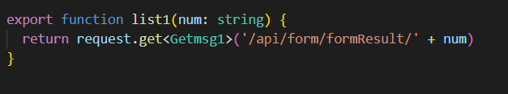
>
> - 封装获取表单详情接口，定义接口类型，以便获取数据
>
>   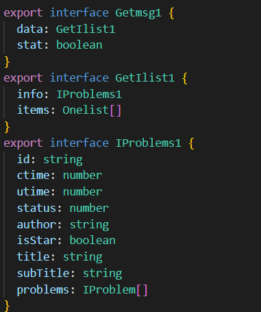

6 月 1 日

> ​ 雷步云：
>
> - 新建表单，表单描述的样式，设置为`textarea`
> - 题目组件的设计、包括`ProblemBase`、`InputProblem`（对应填空、日期、时间、分数）、`SelectProblem`（对应单选、多选、下拉）
> - 填空题组件设计
>
> ​ 周蔚然：
>
> - 编写数据统计页面内容，动态获取接口数据，并作相应判断后赋值到相应位置
>
> 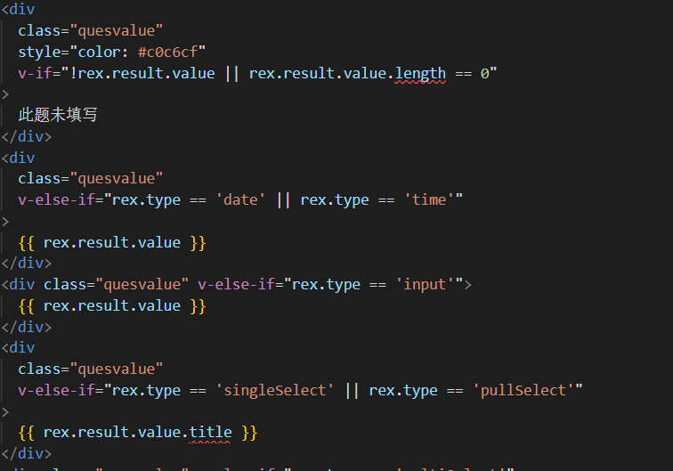
>
> - 查看`vue-qr`模块的用法，以及如何利用该模块生成二维码包含`url`信息

6 月 2 日

> ​ 雷步云：
>
> - 修改填空题的样式
> - 新建表单，表单标题的样式
>
> ​ 周蔚然：
>
> - 编写分享页面，利用`vue-qr`生成二维码，以及下载二维码，复制链接的功能
>
> 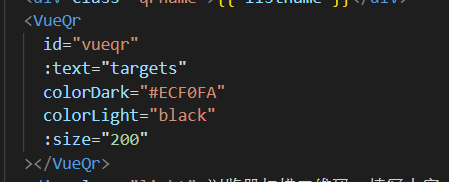
>
> 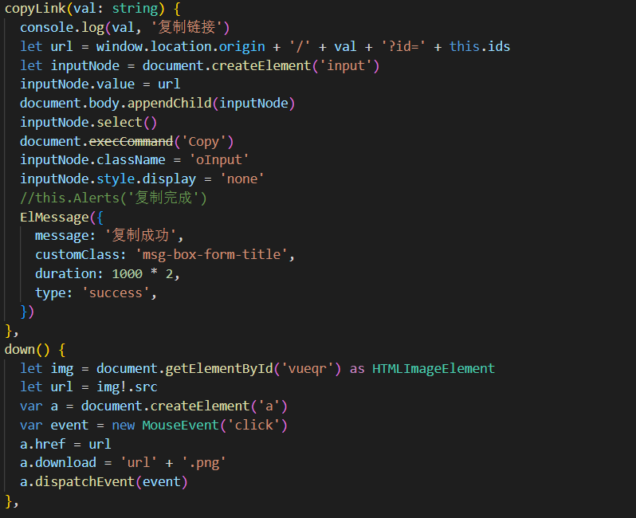
>
> - 学习如何配置路由，使得在同一网段的设备可以通过二维码来访问页面

6 月 3 日

> 雷步云：
>
> - 新建表单：表单标题内容校验，长度<=30
> - 调整左侧操作栏滚动条的样式
>
> 周蔚然：
>
> - 利用填写表单的模块，编写填写详情-问题页面
>
> - 修改各种样式，完善数据分析整体页面，修改若干`bug`，修改路由，以便容易与其他页面配合，成为一个系统
>
> 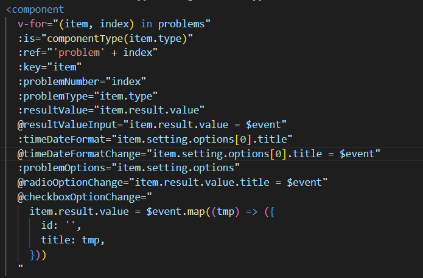

6 月 4 日

> ​ 雷步云：
>
> - 新建表单：预览、保存草稿、完成创建按钮功能的实现

6 月 5 日

> ​ 雷步云：
>
> - 新建表单：分数题、日期题组件
>
> ​ 敖国贝：
>
> - 测试用户模块以及表单模块的接口，大致浏览相关的后台代码，了解接口规范以及相应的返回结果
>
> - 从代码仓库下载项目，查看编码规范。

6 月 6 日

> 雷步云：
>
> - 新建表单：将左侧操作栏中的三项提取为一个组件、包括标题、按钮列表、折叠项。左侧操作栏（添加题目、题目模板、我的常用题）调用三次组件即可
>
> 易佳怡：
>
> - 完成登录注册页面的 UI 设计
>
> - 完成表单验证
>
>   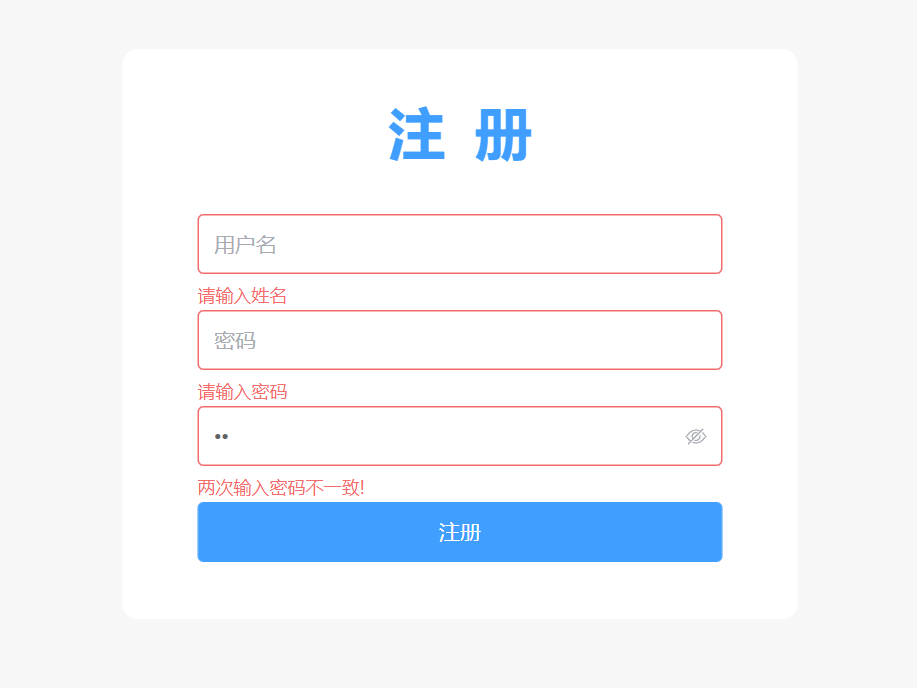
>
> 敖国贝：
>
> - 新建表单填写页面整体的 UI 结构，分为头部组件，中间表单信息，左侧题目列表进度条
> - 定义获取表单的接口返回值类型，封装填写表单的后台 API 接口

6 月 7 日

> ​ 敖国贝：
>
> - 通过获取表单的接口类型，编写获取表单的方法
> - 获取表单信息后，在表单填写页面动态渲染组件，通过给子组件绑定方法实现动态给 value 赋值的效果

6 月 8 日

> ​ 雷步云：
>
> - 重构`ProblemBase`, 设计为 4 个部分，题目标题栏、输入项(插槽)、输入项操作栏(插槽)、底部操作
> - 修改`ProblemBase`基础样式、修改填空题、分数题、日期题
>
> ​ 易佳怡：
>
> - 新增 IUser 和 IForm 类型，定义**UserRes**接口和**FormListRes**接口
>
>   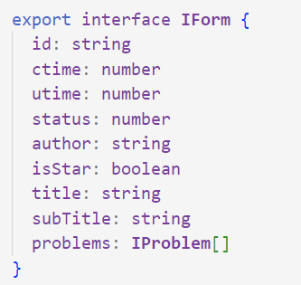
>
> - 封装用户注册登录、处理登录逻辑
>
>   ```js
>     async loginSub() {
>         const res = await login(this.formData.account, this.formData.pwd)
>         if (res.stat != 'ok') {
>           ElMessage({
>             message: res.msg,
>             duration: 2000,
>             type: 'error',
>             customClass: 'msg-box-form-title',
>           })
>         } else {
>           const user = await this.getUser()
>           if (user.avatar === '') {
>             user.avatar =
>               '默认图片路径'
>           }
>           store.commit('setUser', user)
>           sessionStorage.setItem('token', 'Bearer xxxx')
>           sessionStorage.setItem('user', JSON.stringify(user))
>           this.$router.push({
>             name: 'HomeView',
>           })
>         }
>       },
>   ```
>
> ​ 敖国贝
>
> - 新建个人中心的 UI 结构，包含头部，操作区域，个人信息展示区域，以及设置个人信息，设置密码两个模块
> - 定义设置个人信息，设置密码的接口类型，编写设置个人信息，设置密码的方法
> - 完成个人中心的数据渲染以及接口请求

6 月 9 日

> ​ 雷步云：
>
> - 新建表单：添加题目时的动画效果
> - 新建表单：添加题目时自动聚焦到最后一个题目
>
> ​ 易佳怡：
>
> - 完成导航守卫
>
>   ```js
>   router.beforeEach(function (to, from, next) {
>   	if (to.path === '/login' || to.path === '/register') {
>   		next()
>   	} else {
>   		const token = sessionStorage.getItem('token')
>   		if (token) {
>   			next()
>   		} else {
>   			ElMessage({
>   				message: '请先登录',
>   				duration: 2000,
>   				type: 'error',
>   				customClass: 'msg-box-form-title',
>   			})
>   			next('/login')
>   		}
>   	}
>   })
>   ```
>
> - 完成首页 UI 结构设计并渲染 formList 列表
>
> 敖国贝
>
> - 表单填写页面实现左侧进度条点击展开的列表导航效果
> - 根据表单题目列表信息进行类型判断以及 value 判断，渲染出题目列表右侧小图标是否点亮的效果

6 月 10 日

> ​ 雷步云：
>
> - 新建表单：时间题组件
> - 新建表单：时间题选择时间，滚动条平滑的过渡效果
>
> ​ 易佳怡：
>
> - 封装 FormList 组件
>
> - 完成表单标星，删除，开始发布，停止等，实现仅展示星标。
>
>   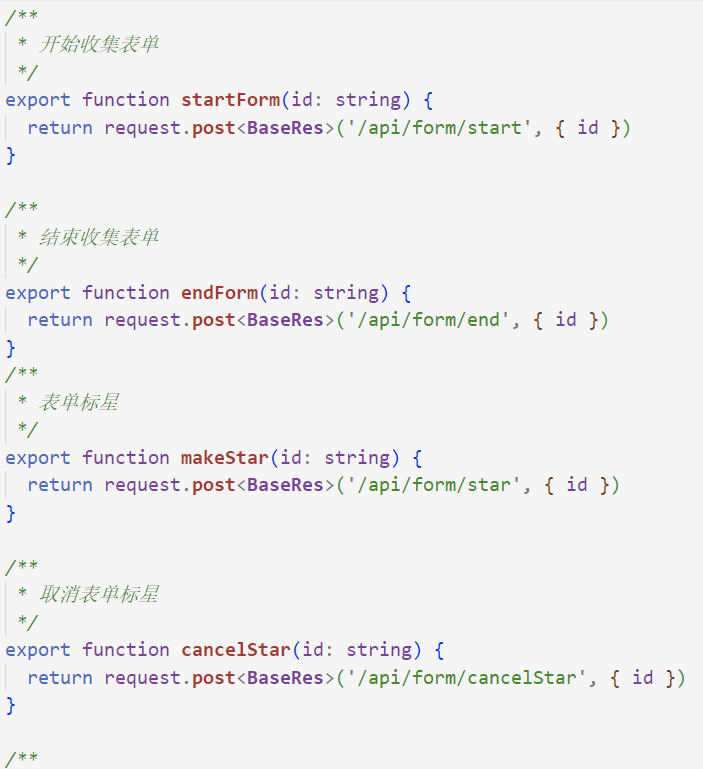
>
>   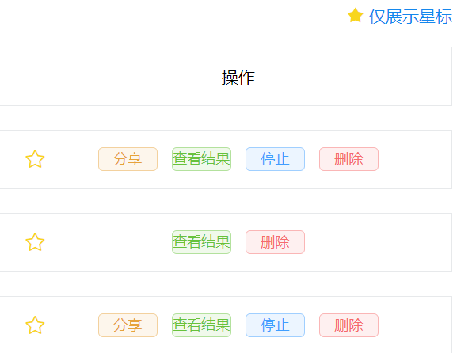
>
> 敖国贝
>
> - 表单填写进行移动适配
> - 实现头部进度条，点击展开遮罩层以及底部渐进弹出题目列表的效果
> - 实现题目列表中点击导航到页面中每题位置的效果

6 月 11 日

> ​ 雷步云：
>
> - 合并`InputProblem`的事件与`props`，添加默认值
> - 选择题组件的设计（单选、多选、下拉），包括编辑与展示时不同的样式
> - 新建表单，题目聚焦时可编辑、blur 时隐藏菜单
>
> ​ 敖国贝
>
> - 封装模态弹窗组件
> - 添加表单填写页面的弹窗效果，使用二维码或者链接分享表单

6 月 12 日

> ​ 雷步云：
>
> - 创建表单时的表单校验
> - 修改选择题组件的样式
>
> ​ 敖国贝
>
> 测试表单填写，反馈题目信息没有 id 导致请求出错的 bug
>
> 在题目组件修改后，修改表单填写页面中题目组件的绑定事件，解决 bug

6 月 13 日

> ​ 雷步云：
>
> - 解决日期题的 Blur 事件，失去焦点时隐藏菜单栏
> - 创建表单添加保存草稿的功能
>
> ​ 易佳怡：
>
> - 分离 MyHeader
>
> - 处理草稿问题以及分页的功能
>
>   
>
> 敖国贝
>
> - 测试草稿保存后打开表单的效果，部分题目 value 渲染不出来，反馈 bug
> - 在题目组件修改后，解决 bug
> - 个人中心用户信息由接口获取转变为从 sessionStorage 获取

6 月 14 日

> ​ 雷步云：
>
> - 创建表单添加常用题的功能
> - 修改题目组件，绑定`result.value`，填写表单的草稿状态可展示数据
>
> ​ 易佳怡：
>
> - 自定义回收站内容
>
>   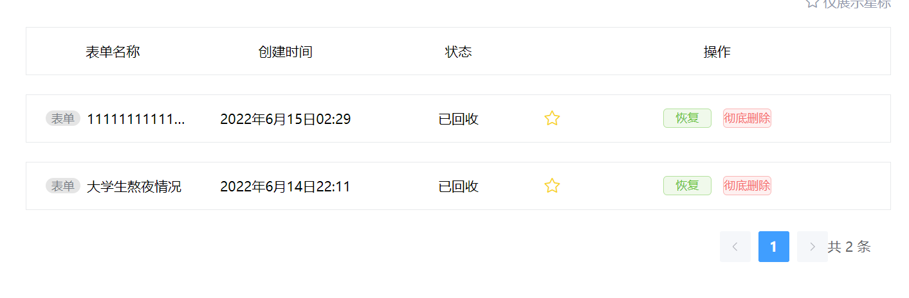
>
> ​ 敖国贝
>
> - 与组员探讨路由跳转问题，统一意见
> - 测试整个项目，反馈 bug

6 月 15 日

> ​ 易佳怡：
>
> - 配置操作中的全部路由，美化 css 样式
>
>   ***
>
>   ​ 开会、演示整个项目的操作步骤、对功能进行整体的测试、整体感知项目的效果、记录遇到的问题并进行修复。

6 月 16 日

> ​ 项目圆满完成，小组成员写心得与收获。

## 问题与解决方法

- 创建表单左侧问题栏的定位问题

  > ​ 解决方法：要求左侧栏与右侧栏在中间表单添加问题出现滚动条时不变化，因此整体采用 flex 布局，左侧栏与右侧栏采用 position: fixed; 即可在 flex 的基础上，进行 fixed 定位，就可以达到在原先位置上 fixed 的效果

- 滚动条的样式问题

  > ​ 解决方法：可以通过以下属性，自定义滚动条的样式
  >
  > ```less
  > &::-webkit-scrollbar {
  > 	width: 6px;
  > 	height: auto;
  > }
  >
  > &::-webkit-scrollbar-button {
  > 	display: none;
  > }
  >
  > &::-webkit-scrollbar-thumb {
  > 	border-radius: 3px;
  > 	background-color: #bec2c9;
  > }
  >
  > &::-webkit-scrollbar-track {
  > 	background-color: transparent;
  > }
  > ```

- 登录接口，提交了账号和密码，但后端报 500 错误，提示参数缺失

  > ​ 解决方法：headers 中显示声明`Content-Type`为`application/json`
  >
  > 原代码：
  >
  > ```javascript
  > fetch('/api/auth/login', {
  > 	method: 'POST',
  > 	body: JSON.stringify({
  > 		account: 'leibuyun',
  > 		pwd: '123456',
  > 	}),
  > })
  > ```
  >
  > 修改后
  >
  > ```javascript
  > fetch('/api/auth/login', {
  > 	method: 'POST',
  > 	body: JSON.stringify({
  > 		account: 'leibuyun',
  > 		pwd: '123456',
  > 	}),
  > 	headers: {
  > 		'Content-Type': 'application/json',
  > 	},
  > })
  > ```

- 点击同一个按钮，无限弹出消息框的问题

  > 解决方法：设置一个变量`flag`，初始值设置为`true`,当需要弹框的时候，不仅满足弹框的条件，还需要`flag===true`才进行弹出、若弹出，则将 flag 设置为 false，同时在`ElMessage`的关闭事件的回调函数中，将`flag`设置回 true，则可以实现当上一个消息框关闭之后，才弹出下一个消息框，不会出现相同的内容重复出现多个消息框的问题。
  >
  > ```typescript
  > // 部分代码
  > if (newVal.length >= 30 && this.msgBoxClose) {
  > 	ElMessage({
  > 		message: '最多输入30个字',
  > 		customClass: 'msg-box-form-title',
  > 		duration: 1000 * 2,
  > 		type: 'warning',
  > 		onClose: () => (this.msgBoxClose = true),
  > 	})
  > 	this.msgBoxClose = false
  > }
  > if (newVal.length > 30) this.title = oldVal
  > ```

- 表单标题未输入时显示“请输入”，聚焦时显示‘’

  > ​ 解决方法：动态绑定表单标题的 placeholder，@focus 与@blue 分别修改 placeholder 的值

- 表单描述的居中与左对齐的实现

  > ​ 解决方法：设置一个变量，记录其时居中还是左对齐，表单描述根据该变量动态选择 class, 修改`text-align`

- 组件通信的问题

  > ​ 有`ProblemBase`，其作为`InputProblem`和`SelectProblem`的子组件，然后爷组件`CreateForm`引入填空题与选择题，希望兄弟组件进行通信。
  >
  > ​ 查询资料发现有如下解决方法：
  >
  > - `provide` + `inject`，通过 provide 传递`this`, 孙组件直接访问爷组件的 data
  > - `$attrs` + `$listeners`
  > - `$on` + `$emit`
  > - `vuex`
  > - 自定义 v-model 或者修饰符`.sync`
  >
  > 最终采用的是第一种方法

- `emit`子组件向父组件传入多个值的问题

  > ​ 由于在子组件中需要传递 2 个参数，同时父组件监听的时候，也需要传递参数
  >
  > 解决方法：可以通过箭头函数接收子组件传递的多个参数，在返回一个函数
  >
  > ```typescript
  > // 代码示例
  > @optionTitleChange="
  >                (idx, newTitle) =>
  >                  (item.setting.options[idx].title = newTitle)
  >              "
  > ```

- 表单问题编辑的时候，聚焦状态时，显示操作栏、鼠标移出之后隐藏操作栏

  > ​ 解决方法：默认状态下，操作栏隐藏。可通过给`ProblemBase`最外层添加属性`tableindex="0"`,使得 div 变为可聚焦的状态，同时，通过`focus-within`属性，读取聚焦的冒泡，内层聚焦时，也会聚焦，此时，显示操作栏。最终可以达到该效果

- 动态选择组件

  > ​ 解决方法：通过`<component :is="组件名"></component>`，来动态设置组件，创建表单，可以通过该方法，动态添加题目，加载不同的题目，此外这也要求题目的数据结构需要相同

- 题目组件区分不同的页面,展示不同效果

> ​ 解决方法：可以通过`provide`选项设置，增加一个变量，记录是否可操作。在创建表单时，设置为 true, 在填写界面与表单详情页面，设置为 false，然后`ProblemBase`根据改值，决定是否隐藏操作栏

- 组件初始化问题

  > ​ 解决方法：由于使用组件的时候，需要一些默认值，因此需要获取后台数据之后，调用`ProblemInit()`方法，设置`problems`添加一些默认值，否则会因为缺少一些默认值而报错。同时需要注意，分数组件，`result.value`的类型为 number

- 日期题创建后，格式确定问题

  > ​ 解决方法：日期题实质上，也是属于填空题，因此 setting 可以用来记录它的格式，年-月、或者年-月-日，同时注意组件初始化的问题

- 日期题编辑时菜单的显示与隐藏

  > ​ 解决方法：大致思路与题目编辑时，focus 与 blur 显示操作栏的思路相同。这里额外增加一个变量，点击按钮进行切换，达到再次点击按钮，菜单隐藏的效果

- 添加题目时的过渡效果

  > ​ 解决方法：添加完题目之后，通过`setTimeout`延迟移动滚动条，移动至最下方, 于是就可以出现一个添加题目时的一个抖动效果。
  >
  > ```typescript
  > let scrollbarRef = this.$refs.scrollbarRef as InstanceType<
  > 	typeof ElScrollbar
  > >
  > let createFormMiddleRef = this.$refs.createFormMiddleRef as HTMLDivElement
  > setTimeout(() => {
  > 	scrollbarRef.setScrollTop(Number(createFormMiddleRef.clientHeight))
  > }, 500)
  > ```

- 时间题当事件格式为时-分的选择时滚动条过渡效果

  > ​ 解决方法：由于这里我使用了 element 组件的 scroll 组件，但是它的移动滚动条至一个位置是瞬发的，我需要过渡效果
  >
  > 因此，通过`setInterval`，从当前位置，到目标位置，每次增加/减少一定的数值，直到到达目标位置，当到达之后，在`clearInterval`，于是就可以展现出滚动条慢慢移动的效果了
  >
  > ```typescript
  > let tmp = oldVal - 1
  > let intval = setInterval(() => {
  > 	scrollbarRef.setScrollTop(tmp * 32)
  > 	tmp--
  > 	if (tmp < this.hVal) {
  > 		clearInterval(intval)
  > 	}
  > }, 50)
  > ```

- 分数题的实现

  > ​ 需要的效果是，鼠标悬浮时，鼠标前的星星全部变亮。选中时，选中的前面的星星变为亮色的状态。
  >
  > 解决方法：监听鼠标移入与移出事件，当 index<=鼠标移入的星星的下标，或者 index<=选中的星星的下标，则它的颜色就是亮色、否则就是暗色。
  >
  > ```html
  > <i
  > 	class="iconfont icon-star"
  > 	v-for="(item, index) in 5"
  > 	:key="item"
  > 	:style="{
  >            color:
  >              (!showActions && index <= mouseHoverIndex) || index <= score
  >                ? '#f8d61d'
  >                : '#c2c2c2',
  >          }"
  > 	@mouseenter="mouseHoverIndex = index"
  > 	@mouseleave="mouseHoverIndex = -1"
  > 	@click="changeScore(index)"
  > ></i>
  > ```

- 选择题选项的添加

  > ​ 基本思路与添加表单中的题目的思路一样。不过由于按钮是在`InputProblem`内部，因此需要通过`props`和`emits`来进行通信，最终修改的是`CreateForm`中对应问题的 setting 的内容

- 草稿功能的设计与实现

  > ​ 由于后端并没有提供修改表单的 API 接口，因此草稿采用 local storage 的方式，保留在本地，存储草稿列表。自定义草稿的 status 为 1
  >
  > - **1：草稿** --->草稿 ---> 编辑、删除
  >
  > - 2：已创建 --->已创建 ---> 发布、删除
  > - 3：已发布 --->收集中 ---> 分享、查看结果、停止（、删除
  > - 4：已结束 --->已结束---> 查看结果、删除
  > - 5: 回收站
  >
  > 每一个表单的数据结构如下
  >
  > ```json
  > {
  > 	"id": "e9ff1679-1e7c-44ee-9ec7-0c54f17d0fa3",
  > 	"ctime": 1653784537889,
  > 	"utime": 1653784537889,
  > 	"status": 2,
  > 	"author": "aa6ab6b8-d247-469c-a94b-ad97b39cfbd2",
  > 	"isStar": false,
  > 	"title": "title",
  > 	"subTitle": "subTitle",
  > 	"problems": [
  > 		{
  > 			"title": "problem1Title",
  > 			"type": "input",
  > 			"required": true,
  > 			"isNew": true,
  > 			"id": "13d2023b-77ca-41c4-bf92-476bf9f76d02"
  > 		}
  > 	]
  > }
  > ```
  >
  > ① 页面加载的时候，在获取完表单详情之后，判断有无草稿，如果有，进行赋值
  >
  > ② 保存草稿的时候，判断是否存在了这个表单的草稿（根据 id），如果存在则修改 problems，不存在则添加新的，最后重新保存到 local storage
  >
  > ③ 提交的时候，先判断是不是草稿，不是就直接提交。如果是的话，就删除 local storage 中的这个草稿
  >
  > 最后，在首页路由传参的时候，通过 query，传递 form 的信息到创建表单

- 添加常用题的设计与实现

  > 分为两类
  >
  > 第一是直接在编辑题目的时候，通过按钮添加到常用题。
  >
  > 第二是在管理界面单独选择添加常用题，这部分也需要`<component :is=""></component>`，在编辑的时候，由于我在兄弟通信时采用的是`provide/inject`的方式，孙组件需要爷组件的`problems`，因此在管理常用题的时候，也需要该数组，在点击管理的时候，显示模态框，同时通过 push()添加一个题目，在切换当前编辑的题目的时候，pop(), 然后根据新添加的类型，push()新的题目，最后如果关闭模态框的时候，pop 最后一个题，于是，就可以调用封装好的组件，在模态框中也展示对应样式的组件，最终实现添加常用题的功能

- 注册组件中密码相等验证失效

  > ​ 解决方法：**element plu 官网提供的自定义验证函数是放在 data 中**，然后在 rules 中进行引用
  >
  > 由于 ts 的影响导致类型出错，**将验证函数放在 methods 后**，验证生效
  >
  > ```js
  > methods: {
  > validatePass2(rule: string, value: string, callback: any) {
  > if (value === '') {
  >   callback(new Error('请再次输入密码'))
  > } else if (value !== this.formData.pwd) {
  >   callback(new Error('两次输入密码不一致!'))
  > } else {
  >   callback()
  > }
  > },
  > },
  > ```

- 取消滚动条

  > ​ 解决方法：将头部结构放入 main 中

- 登录后如何保存用户状态的问题

  > 问题说明：首先考虑的是用 vuex 保存用户信息，后期发现**Vuex 刷新后数据会消失**
  >
  > ​ 随后考虑用 localstorage 保存，但是这样的话，用户信息一直存在浏览器且不安全
  >
  > ​ 最后决定用 session 进行存储，这样用户信息可以随着窗口的关闭而消失
  >
  > 解决方法：**利用 session 存储用户信息**
  >
  > 原代码：
  >
  > ```javascript
  > import { createStore } from 'vuex'
  > import { IUser } from '../types'
  >
  > export default createStore({
  > state: {
  > user: {} as IUser,
  > show: 0,
  > },
  > getters: {
  > user: (state) => state.user,
  > // show: (state) => state.show,
  > },
  > mutations: {
  > setUser(state, user) {
  > state.user = user
  > },
  > // showAction(state, params) {
  > //   state.show = params
  > // },
  > },
  > actions: {},
  > modules: {},
  > })
  > ```
  >
  > 修改后
  >
  > ```javascript
  > sessionStorage.setItem('user', JSON.stringify(user))
  > ```

- 限制用户未登录直接进入首页的情况

  > 解决方法：**设置导航守卫**
  >
  > ```javascript
  > //用户登录后，在session中自定义一个token
  > sessionStorage.setItem('token', 'Bearer xxxx')
  >
  > //通过是否有session值判断用户是否登录
  > const token = sessionStorage.getItem('token')
  > if (token) {
  > 	next()
  > }
  > ```

- 完成仅展示标星功能

  > 解决方法：对 formList 数组进行遍历，对样式进行动态绑定
  >
  > ```javascript
  > onlyShow() {
  > if (!this.showOnlyStar) {
  >   this.showOnlyStar = true
  >   for (let i = 0; i < this.formList.length; i++) {
  >     if (!this.formList[i].isStar) {
  >       this.formList.splice(i, 1)
  >       i--
  >     }
  >   }
  > } else {
  >   this.showOnlyStar = false
  >   this.fun()
  > }
  > },
  > ```
  >
  > ```html
  > <div :class="showOnlyStar ? 'star onlyStar' : 'star'" @click="onlyShow">
  > 	<span :class="showOnlyStar ? 'fullStar' : ''">
  > 		<i class="iconfont icon-star-empty" v-show="!showOnlyStar"></i>
  > 		<i class="iconfont icon-star-full" v-show="showOnlyStar"></i>
  > 	</span>
  > 	仅展示星标
  > </div>
  > ```

- 表单分页功能

  > 解决方法：**利用 el-pagination**,新增 currentForm 数组，用来存储当前页面的数据，动态的赋值给 formList
  >
  > ```html
  > <div class="block">
  > 	<el-pagination
  > 		align="right"
  > 		@current-change="handleCurrentChange"
  > 		:current-page="currentPage"
  > 		:page-size="pageSize"
  > 		:total="formList.length"
  > 		layout="prev, pager, next,total"
  > 		background
  > 		v-show="formList.length !== 0"
  > 	/>
  > </div>
  > ```
  >
  > ```js
  > this.currentForm = this.formList.slice(
  > 	(this.currentPage - 1) * this.pageSize,
  > 	this.currentPage * this.pageSize
  > )
  > ```

- 头部右边插槽不一致的问题

  > 解决方法：设置默认内容，右边没有元素的情况，则用空的 div 代替
  >
  > ```html
  > <slot name="right">
  > 	<div
  > 		class="user"
  > 		tabindex="0"
  > 		@click="howshow = !howshow"
  > 		@blur="howshow = false"
  > 	>
  > 		<div class="user-img">
  > 			
  > 		</div>
  > 		<p class="user-title">{{ user.account }}</p>
  > 		<div class="logout" v-show="howshow">
  > 			<div>{{ user.account }}</div>
  > 			<div @click="goPersonal" @click.stop>个人中心</div>
  > 			<div @click="goout">退出登录</div>
  > 		</div>
  > 	</div>
  > </slot>
  > ```

- 处理草稿问题

  > 解决方法：通过用户名+drafs 从 localStrorage 读取草稿数据，并在初始化时将其与端口数据合并
  >
  > ```js
  > let dLstStr = localStorage.getItem(account + 'DraftList')
  > let draftList = [] as IForm[]
  > if (dLstStr) {
  >   draftList = JSON.parse(dLstStr)
  > }
  > this.drafts = draftList
  > const { data } = await getFormList(account)
  > this.formList = [...draftList, ...data.items]
  > ```

- 解决回收站和列表切换问题

  > 解决方法：设置两个数组，分别用来存储两份数据，在删除的时候记得过滤
  >
  > ```js
  > async formDelete(id: string) {
  > if (this.noDeleteForm) this.noDeleteForm = []
  > for (let i = 0; i < this.formList.length; i++) {
  >   if (this.formList[i].id === id) {
  >     //判断是否为草稿
  >     if (this.formList[i].status === 1) {
  >       this.formList[i].status = 15
  >     } else {
  >       this.formList[i].status = 5
  >     }
  >     this.deleteForm.push(this.formList[i])
  >   } else {
  >     this.noDeleteForm.push(this.formList[i])
  >   }
  > }
  > this.formList = this.noDeleteForm
  > this.currentForm = this.noDeleteForm.slice(
  >   (this.currentPage - 1) * this.pageSize,
  >   this.currentPage * this.pageSize
  > )
  > localStorage.setItem(
  >   this.user.account + 'Delete',
  >   JSON.stringify(this.deleteForm)
  > )
  > },
  > ```

- 解决恢复表单后找不到原始状态问题

  > 解决方法：在 localStrorage 存储一个由 id 和 old（旧的状态）存储的对象数组
  >
  > ```js
  > //存oldId
  >     const oldStr = localStorage.getItem(this.user.account + 'oldId')
  >     let oldList = [] as { id: string; old: number }[]
  >     if (oldStr) {
  >       oldList = JSON.parse(oldStr)
  >     }
  >     let idx = -1
  >     for (let i = 0; i < oldList.length; i++) {
  >       if (oldList[i].id === id) {
  >         idx = i
  >         break
  >       }
  >     }
  >     if (idx === -1) {
  >       oldList.push({
  >         id: id,
  >         old: this.formList[i].status,
  >       })
  >     } else {
  >       oldList[idx].old = this.formList[i].status
  >     }
  >     localStorage.setItem(
  >       this.user.account + 'oldId',
  >       JSON.stringify(oldList)
  >     )
  >
  > //恢复
  > const oldStr = localStorage.getItem(this.user.account + 'oldId')
  >     let oldList = [] as { id: string; old: number }[]
  >     if (oldStr) {
  >       oldList = JSON.parse(oldStr)
  >     }
  >     for (let j = 0; j < oldList.length; j++) {
  >       if (oldList[j].id === id) {
  >         this.deleteForm[i].status = oldList[j].old
  >         break
  >       }
  >     }
  > ```

- 刷新后回收站消失问题

  > 解决方法：在删除时将删除的数据保存在 localStrorage 中，初始化时过滤一下
  >
  > ```js
  > localStorage.setItem(
  > 	this.user.account + 'Delete',
  > 	JSON.stringify(this.deleteForm)
  > )
  > ```
  >
  > ```js
  > let DeleteStr = localStorage.getItem(this.user.account + 'Delete')
  > if (DeleteStr) {
  > 	this.deleteForm = JSON.parse(DeleteStr)
  > 	this.formList = this.formList.filter(
  > 		(form) =>
  > 			this.deleteForm.filter((iform) => iform.id === form.id).length === 0
  > 	)
  > }
  > ```

- 表单填写题目列表小图标点亮效果：

解决方法：由于题目的初始化 result 的 value 类型包括字符串，数字，对象，数组四种类型，因此 value 判空要根据题目类型和 value 值来分类进行判断。将初始值不为空的题目的 index 放入数组以及统计填写完成题目的总数以及百分比。最后通过 IndexOf()函数来判断每题是否完成填写，进而点亮小图标。

- 空数组的判断：

解决方法：由于空数组里面含有空字符串，所以 length 为 1，boolean 也为 true，因此要用其它方法判断

```
 if (this.problems[k].type === 'multiSelect') {
          let arr = String(this.problems[k].result?.value).split(',')
          // Boolean(arr[0])也可判断空数组
          if (JSON.stringify(arr) != '[""]') {
            this.num++
            this.numArr.push(Number(k))
          }
```

- 表单填写移动端题目列表底部弹出效果：

解决方法：由于避免用 js 操作 DOM 结构，最后通过动态绑定样式的 bottom 定位，点击后改变 bottom 的值，通过 transtion 实现渐变效果

- 初始化题目完成度百分比：

解决方法：一开始把该函数放在 mounted 生命周期函数里一直不起作用，后来放在 beforeUpdate 生命周期函数里面、

- 媒体查询中写子组件的样式不起作用：

解决方法：

```
:deep(.modal-body) {
    padding: 10px;
  }
  :deep(#vueqr) {
    margin: 0px 3%;
  }
  :deep(.inputBtn) {
    height: 25px;
  }
```

- 表单填写导航栏点击列表中的题目滚动到相应区域:

解决方法：

```
//分别截取片段
<a :href="'#problem' + index"></a>
```

```
<component
        v-for="(item, index) in problems"
        :id="'problem' + index"
      >
</component>
```

```
//平滑滚动的效果
#bg {
  scroll-behavior: smooth;
  height: 1000px;
  overflow-y: scroll;
}
```

- style 中引入样式污染全局：

解决方法：

```
<style src="../assets/css/style.css" scoped></style>
```

## 个人总结与收获

> ​ 雷步云：本次项目是从零开发一个完整的项目，从 5 月 29 日开始着手准备开发，到 6 月 15 日内容基本完成，时间并不算长，但项目完成的那一刻，心里的一块石头终于落了地，成就感油然而生，我感受到了开发项目的不易，但我也充分享受着编程的快乐。这个项目的完成离不开我们小组成员每一个人的努力与付出，一开始的毫无方向，经过我们小组成员互相交流思考讨论，将问题细分开来，分而治之，逐一击破难题，最终完成整个项目，我知晓了合作的重要性。此外本次项目还巩固了之前所学习的知识，将知识应用于实践，只有实际开发了，实际去思考了，才会知道哪些内容是自己已经掌握、哪些还需要去学习加强，遇到了实际的问题，去寻找解决方法，我知晓了实践的重要性。不仅如此，一开始良好的设计也非常重要，题目组件是我本次开发遇到的最麻烦的一个内容环节，它是多个页面都会进行使用，但具体的展示效果是不同的，设计组件的时候，需要兼顾多个页面，此外不同题目之间的结构也是很类似的，这就需要对其公共部分进行抽取，找出相似点，由于一开始的设计不够合理，导致重构了很多次基础的代码，还是因为一开始的考虑不够周全，这个方面要更加努力才行！总而言之，本次项目的开发，提升了个人的能力、更加坚定了从事编程行业的决心，代码改变世界！
>
> ​ 周蔚然：通过这次的学习，我学到许多前端知识，从`html5`到`css`在到`js，ts`对于基本的前端语言有了基础的掌握，同时对于移动端的适配学到了新的方法，可以利用`@media screen and (min-width: xpx)`就可以让页面适配不同的像素页面，还学到了`vue`的用法，让页面各个地方模块化，组件化，让页面的实现更加简洁，方便。最后参与了合作项目，学会了如何让多个人通过`git`来分工合作写代码，对以后的学习和工作又了很大的帮助。
>
> ​ 易佳怡：本次项目主要负责注册，登录，首页和头部组件部分，对 element plus 的使用更加的熟练，例如表单验证，对 session，localstrorage，token，cookie 等了解更加透彻，对接口的使用和继承也有了部分了解，之前总是困惑接口的意义，总觉得是在徒增编码难度，但是发现在大型开发项目中，接口的复用性提高，也更加贴合后端的工作，维护起来也更加方便。导航守卫的使用使得整个项目更加安全，当然关于用户信息的安全问题还需要进行更多的处理。使用 git 进行团队开发，让我受益匪浅，对以后的工作也会有更多的帮助。当然还是有一些不足，对数据的处理有些冗余，对数组的一些方法 filter,map 等使用还不够熟练，有待加强。总之，经过这次的项目，收获满满，看着项目一点点搭建起来的过程非常的快乐且有成就感！对未来的编程之旅充满了信心！
>
> 敖国贝：在这次的项目中，虽然只负责部分模块，但是在与组员的紧密沟通中，对别的模块也加深了理解。就自己的部分而言，对一些数据进行赋值操作的时候，对于 TS 的类型定义掌握得更熟练了。另外在项目中对封装的二维码组件，题目组件，头部组件，模态框组件等的应用，也使我体会到了组件复用的重要性，大大降低代码冗余。由于可能在修改自身组件的同时会影响其它页面的运行效果，需要告诉其他人进行相应的修改，由此感受到了合作与沟通的重要性。另外在样式方面由于一开始没有设计好，导致做移动端适配的时候，甚至需要修改页面结构才能实现想要的效果，在今后的开发过程中需要全面考虑不同情况后再下手，尽量减少后期修修补补。同样，自己思考过后某个功能逻辑理不清的时候，可以和组员交流，一个新的思路可能就此展开。在开会的时候测试，团队统一提出的不好的效果，我都乐于吸取建议并着手修改，都是为了项目变得更好。言而总之，在组长的带领下以及组员的共同努力下，我们四个人共同完成了项目，最后在完成效果上达成了一致的意见，对于我来说是一次非常好的经历。
