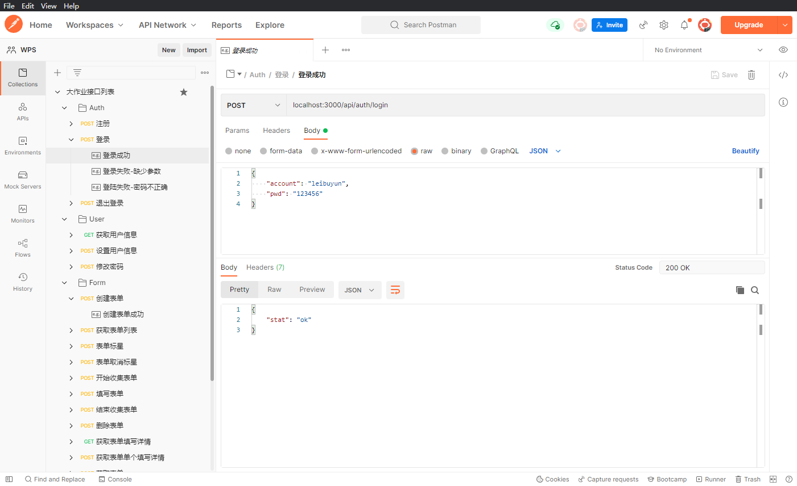

# WPS大作业

## 小组名单

- 组长：雷步云

- 成员：易佳怡 敖国贝 周蔚然

## 模块划分

## 小组分工

## 项目说明

## 运行说明

## 每日进度

### 每日进度

5月29日

> 雷步云：
>
> - 整理后端API文档，测试每一个接口。记录所有可能的返回样例，保存结果至Postman
>
>   
>
> - 创建代码仓库、统一代码规范（`.editorconfig`、`.prettierrc`）

5月30日

> ​	雷步云：
>
> - 新建表单页面整体的UI结构。分为三部分左侧问题列表、中间表单信息、右侧操作按钮
> - 定义Problem类型、定义接口返回值的类型
> - 封装用户登录、获取基础题目、获取基础题目类型后台的API接口

## 问题与解决方法

- 创建表单左侧问题栏的定位问题

  > ​	解决方法：要求左侧栏与右侧栏在中间表单添加问题出现滚动条时不变化，因此整体采用flex布局，左侧栏与右侧栏采用position: fixed; 即可在flex的基础上，进行fixed定位，就可以达到在原先位置上fixed的效果

- **滚动条的样式问题**

  > ​	解决方法：可以通过以下属性，自定义滚动条
  >
  > ```less
  >     &::-webkit-scrollbar {
  >       width: 6px;
  >       height: auto;
  >     }
  > 
  >     &::-webkit-scrollbar-button {
  >       display: none;
  >     }
  > 
  >     &::-webkit-scrollbar-thumb {
  >       border-radius: 3px;
  >       background-color: #bec2c9;
  >     }
  > 
  >     &::-webkit-scrollbar-track {
  >       background-color: transparent;
  >     }
  > ```

- 登录接口，提交了账号和密码，但后端报500错误，提示参数缺失

  > ​	解决方法：headers中显示声明`Content-Type`为`application/json`
  >
  > 原代码：
  >
  > ```javascript
  > fetch('/api/auth/login', {
  >         method: 'POST',
  >         body: JSON.stringify({
  >           account: 'leibuyun',
  >           pwd: '123456',
  >         }),
  >       })
  > ```
  >
  > 修改后
  >
  > ```javascript
  > fetch('/api/auth/login', {
  >         method: 'POST',
  >         body: JSON.stringify({
  >           account: 'leibuyun',
  >           pwd: '123456',
  >         }),
  >         headers: {
  >           'Content-Type': 'application/json',
  >         },
  >       })
  > ```
  >
  > 

