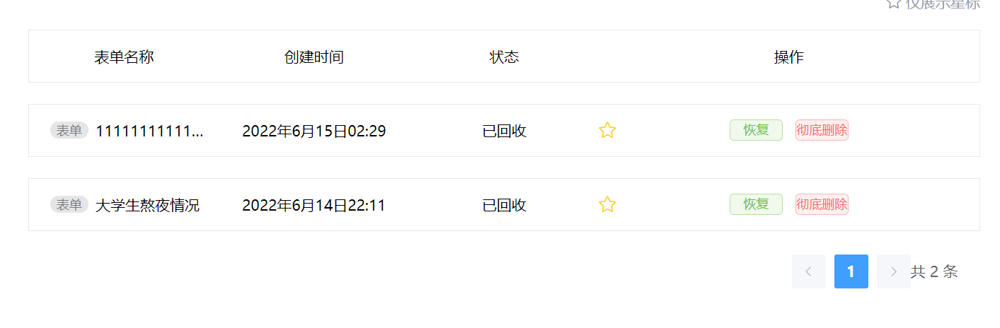
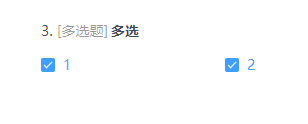

# form-ui

## 测试账号

- 用户名: `lazy`
- 密码：`123456`

## 项目启动步骤

```
npm install
npm run serve
```

### Compiles and minifies for production

```
npm run build
```

### Lints and fixes files

```
npm run lint
```

## 项目功能介绍

### 注册页

含表单验证功能


### 登录页

含表单验证功能，**导航守卫功能**，登陆后对用户信息进行session存储


**亮点**：导航守卫

```js
router.beforeEach(function (to, from, next) {
if (to.path === '/login' || to.path === '/register') {
next()
} else {
const token = sessionStorage.getItem('token')
if (token) {
 next()
} else {
 ElMessage({
   message: '请先登录',
   duration: 2000,
   type: 'error',
   customClass: 'msg-box-form-title',
 })
 next('/login')
}
}
})
```

### 首页

含表单列表和**回收站**功能，表单标星，以及各种按钮跳转功能，**点击整个表单依然可以跳转**，可对草稿和未发布的表单进行拦截跳转


**亮点**：**自增回收站功能**



通过localStrorage进行数据的存储转换

初始化（刷新）时：读取localStrorage的数组进行过滤处理

```js
let DeleteStr = localStorage.getItem(this.user.account + 'Delete')
if (DeleteStr) {
this.deleteForm = JSON.parse(DeleteStr)
this.formList = this.formList.filter(
(form) =>
this.deleteForm.filter((iform) => iform.id === form.id).length === 0
)
}
```

数据区分：定义两个数组分别用来存储列表和回收站

```js
//初始化时赋初值，删除时修改数组 
noDeleteForm: [] as IForm[],
deleteForm: [] as IForm[],
```

删除逻辑：**将status设置为5**，将数据从deleteForm中去除，加入noDeleteForm中，**需要特殊保存status，方便后续的恢复逻辑**，草稿需要特殊处理

```js
//删除表单
async formDelete(id: string) {
if (this.noDeleteForm) this.noDeleteForm = []
for (let i = 0; i < this.formList.length; i++) {
if (this.formList[i].id === id) {
//存oldId
const oldStr = localStorage.getItem(this.user.account + 'oldId')
let oldList = [] as { id: string; old: number }[]
if (oldStr) {
  oldList = JSON.parse(oldStr)
}
let idx = -1
for (let i = 0; i < oldList.length; i++) {
  if (oldList[i].id === id) {
    idx = i
    break
  }
}
if (idx === -1) {
  oldList.push({
    id: id,
    old: this.formList[i].status,
  })
} else {
  oldList[idx].old = this.formList[i].status
}
localStorage.setItem(
  this.user.account + 'oldId',
  JSON.stringify(oldList)
)
//判断是否为草稿
if (this.formList[i].status === 1) {
  this.formList[i].status = 15
} else {
  this.formList[i].status = 5
}
this.deleteForm.push(this.formList[i])
} else {
this.noDeleteForm.push(this.formList[i])
}
}
this.formList = this.noDeleteForm
this.currentForm = this.noDeleteForm.slice(
(this.currentPage - 1) * this.pageSize,
this.currentPage * this.pageSize
)
localStorage.setItem(
this.user.account + 'Delete',
JSON.stringify(this.deleteForm)
)
},
```

恢复逻辑：**读取oldList，找到原始status**，将数据从noDeleteForm中去除，加入deleteForm中

```js
//恢复表单
async formReview(id: string) {
for (let i = 0; i < this.deleteForm.length; i++) {
if (this.deleteForm[i].id === id) {
const oldStr = localStorage.getItem(this.user.account + 'oldId')
let oldList = [] as { id: string; old: number }[]
if (oldStr) {
  oldList = JSON.parse(oldStr)
}
for (let j = 0; j < oldList.length; j++) {
  if (oldList[j].id === id) {
    this.deleteForm[i].status = oldList[j].old
    break
  }
}
this.noDeleteForm.push(this.deleteForm[i])
this.deleteForm.splice(i, 1)
i--
}
}
this.currentForm = this.deleteForm
localStorage.setItem(
this.user.account + 'Delete',
JSON.stringify(this.deleteForm)
)
},
```

彻底删除逻辑：类似原删除逻辑，**需要对草稿进行特殊处理**

```js
//彻底删除
async formMove(id: string) {
await deleteForm(id)
for (let i = 0; i < this.deleteForm.length; i++) {
if (this.deleteForm[i].id === id) {
if (this.deleteForm[i].status === 15) {
  let idx = -1
  for (let j = 0; j < this.drafts.length; j++) {
    if (this.drafts[j].id === id) {
      idx = j
      break
    }
  }
  this.drafts.splice(idx, 1)
  localStorage.setItem(
    this.user.account + 'DraftList',
    JSON.stringify(this.drafts)
  )
}
this.deleteForm.splice(i, 1)
i--
}
}
localStorage.setItem(
this.user.account + 'Delete',
JSON.stringify(this.deleteForm)
)
this.currentForm = this.deleteForm
},
```

### 头部组件

利用**具名插槽**实现不同页面头部组件的复用，含跳转至个人中心和退出登录功能


**亮点**：点击弹出框以外关闭弹出框

---

### 新建表单页面


实现了题目添加、问题输入、题目设置、选项设置、题目删除、题目复制、是否必填、添加常用题、管理常用题、预览、保存草稿、完成创建的功能。


问题组件

填空题

- 编辑

  

- 填写

  

单选题

- 编辑

  

- 填写

  

多选题

- 编辑

  

- 填写

  

下拉、日期、时间、打分题


---


### 数据统计部分

>通过从首页获取的表单id，动态添加展示表单的填写信息，当表单还没有一份数据时，会跳转到分享页面，从分享页面复制链接或扫码或从表单问题页面点击填写表单就可以跳转到表单填写页面

### 填写详情-表单问题部分

>通过从首页获取的表单id，动态生成表单问题信息，在这个页面不支持提交，只支持预览，点击提交按钮会出现不能提交提示弹窗，从这个页面也可以跳转到表内填写页面

### 分享页面

>利用`vue-qr`模块与首页获取的表单id生成二维码，当配置好路由，并且用户都在同一`wifi`下时，扫描二维码即可访问表单填写页面，在分享页面也可以下载二维码或者复制链接，跳转到表单填写页面

* 配置路由

  >在vue.config.js中`devServer`里添加`port:8080,host:`本机所处`ip`，可以通过`win+r`，`cmd`，`ipconfig`查看ipv4地址，填写好后`npm run serve`，当local和Network显示的`url`一致的时候即配置成功，如果还是无法访问，尝试关闭防火墙

